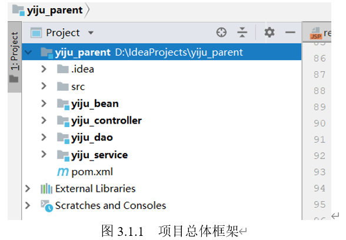
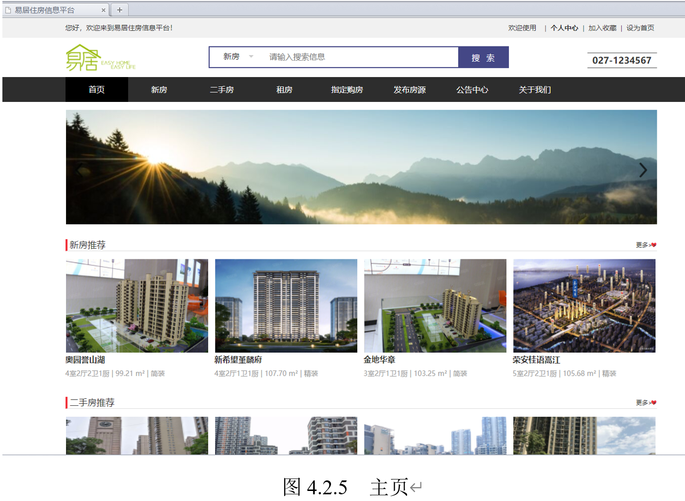
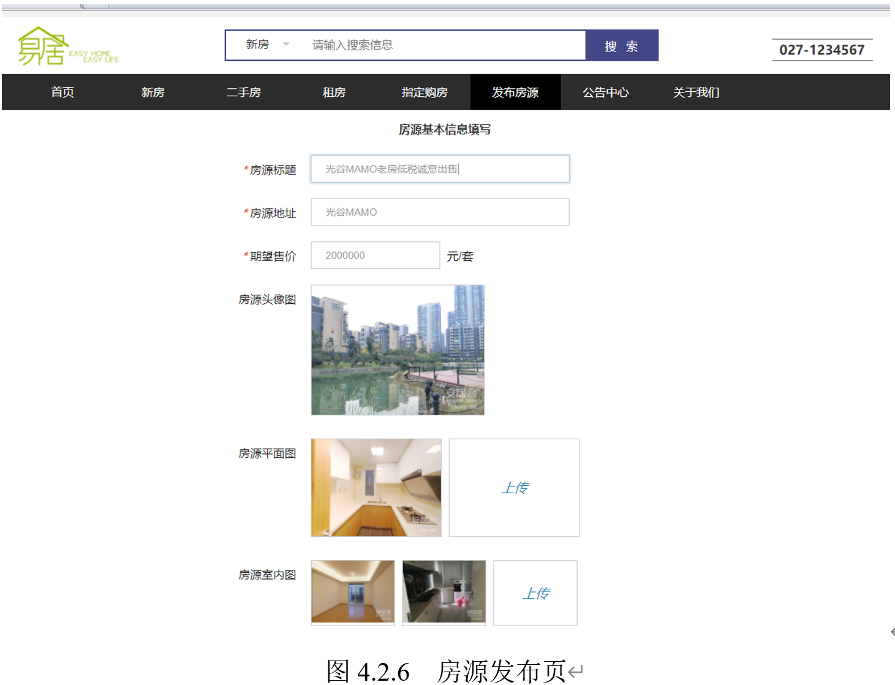
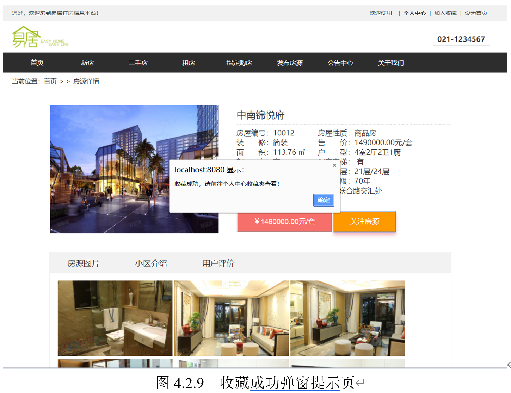
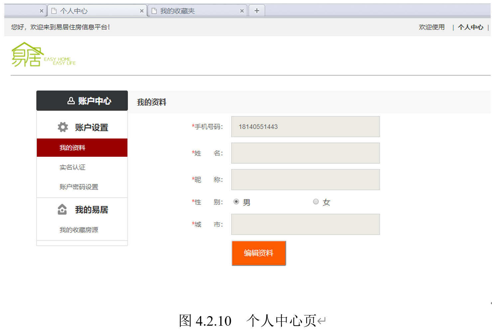
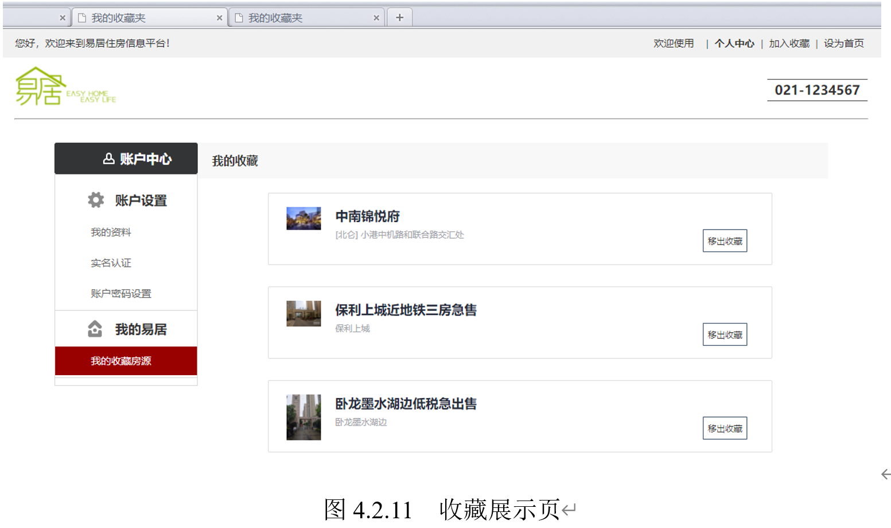

## 基于SSM的易居住房信息平台

### 1、目录说明：

+   docs目录：包含本项目的配置说明和项目演示文档。
+   database目录：本项目的SQL脚本。

### 2、开发环境

+   JDK 1.8
+   MySQL 5.7
+   Tomcat 8.0
+   Maven 3.6.0

**主要技术点：**

+   SSM
+   阿里云短信
+   七牛云存储

### 3、项目架构

 ### 4、项目截图

>   完整的演示截图，请前往docs目录下查看。

>   本项目的任何BUG、业务逻辑不再维护。仅供个人学习参考使用。

